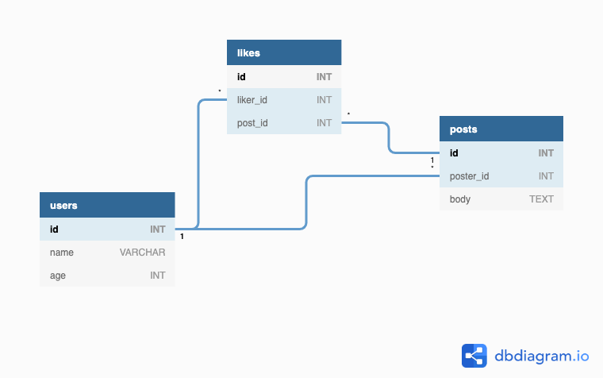
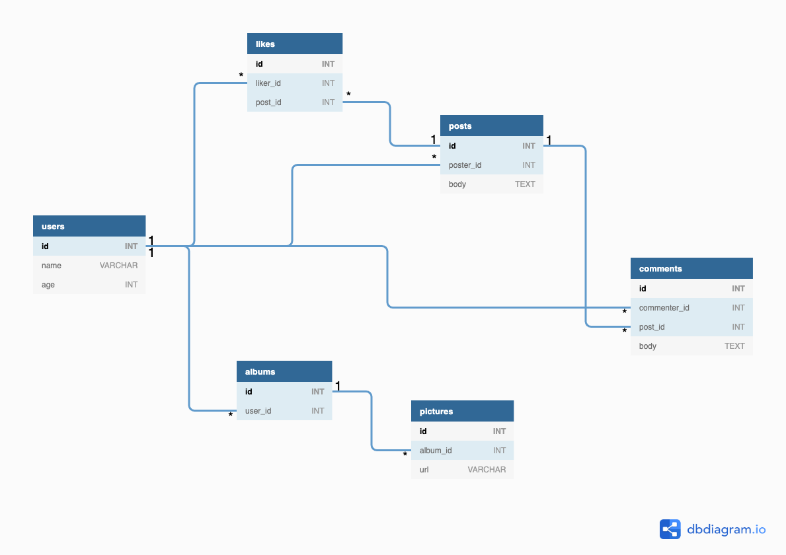

# Pursuit-Core-Web-Postgres-Lab

Build a database for a Facebook-style app. Your Database should have **SQL tables** for the following data: Users, Posts, and Likes.

Let's expand this simple structure to something a little bit deeper. Let's also use the conceptual structure of _primary_ and _foreign_ keys. Our database, at the end of the day, should be structured like this:

## v1

### Tables
- Users (_table_)
  - `id` (_column_): integer, **primary key**
  - `name`: string
  - `age`: integer
- Posts
  - `id`: integer, **primary key**
  - `poster_id`: integer, **foreign key** referencing the column `id` in Users.
  - `body`: string
- Likes
  - `id`: integer, **primary key**
  - `liker_id`: integer, **foreign key** referencing the column `id` in Users
  - `post_id`: integer, **foreign key** referencing the column `id` in Posts.

### Diagram

### Explanation

- Users are the main actors in our Database.
- Users can create many Posts.
- A Post can be liked by many Users.
- Posts are connected to users through the `poster_id` column.
- Likes are connected to Posts through the `post_id` and to the User that liked the post by the `liker_id` column.

### Add and Manipulate Data

Write SQL statements that accomplish/express the following.

- [ ] Add 5 users
- [ ] One user should have three posts. Add at least one post for the rest of users. 
- [ ] User with `id = 1` likes all the other users posts.
- [ ] User with `id = 2` likes only his/her own post.
- [ ] User's `2` & `1` posts are liked by user `3` 
- [ ] User `4` likes all posts except her own and user's `1`.
- [ ] All the posts of user's `1`, `2`, `3` are liked by user `5`.
- [ ] Update the age of user with `id` 5 to be `31`.
- [ ] Update the name of user `3` to be `Alfred`
- [ ] User `1` stops liking user's `2` post.
- [ ] The user who had three posts decides to delete his/her last post.
- [ ] User `2` decides to delete their account from of social media app. 
- [ ] Find the user who has given the most likes.
- [ ] Find the most liked post.
- [ ] Find all the information of the user how posted the most liked post.

## v2: Bonus

### Tables
Add to your database the following tables: 

- Comments
  - `id`: integer, **primary key**
  - `commenter_id`: integer, **foreign key** referencing the column `id` in Users.
  - `post_id`: integer, **foreign key** referencing the column `id` in Posts.
  - `body`: string
- Albums
  - `id`: integer, **primary key**
  - `user_id`: integer, **foreign key** referencing the column `id` in Users
- Pictures
  - `id`: integer, **primary key**
  - `album_id`: integer, **foreign key** referencing the column `id` in Albums
  - `url`: string

### Diagram

[Interactive Diagram Here](https://dbdiagram.io/d/5db872c3fa792a62f50da1a5)

## Explanation
Let's think about these associations. In a vacuum, it might not be clear what each individual one is doing. However, we can gain a better understanding when we think about what, exactly, each of these associations is for.

Let's break it down:

- Users can create many Posts and Albums. They can also create Likes and Comments on Posts. Therefore, all of these tables have a direct relationship to Users via some kind of `user_id` column.
- Posts can have many Comments and Likes.
- Comments and Likes are connected to both the Users table and the Posts table. This is because, even though Posts are made by one user, a comment could be made by a different user.
- Albums contain many Pictures, but each Picture isn't associated with a User - they are associated with an Album, which is then associated with a User. This is because only the user who created the Album can add a Picture to it. Therefore, a `user_id` column in Pictures would be redundant.

## Resources
*[SQLBolt: Inserting Rows](https://sqlbolt.com/lesson/inserting_rows)
*[SQLBolt: Updating Rows](https://sqlbolt.com/lesson/updating_rows)
*[SQLBolt: Deleting Rows](https://sqlbolt.com/lesson/inserting_rows)
